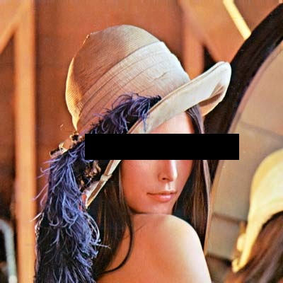
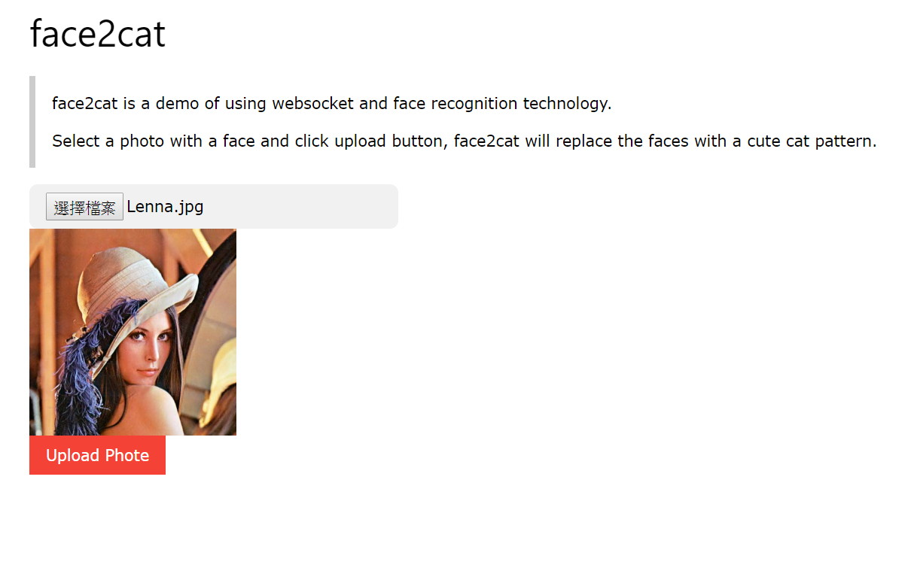
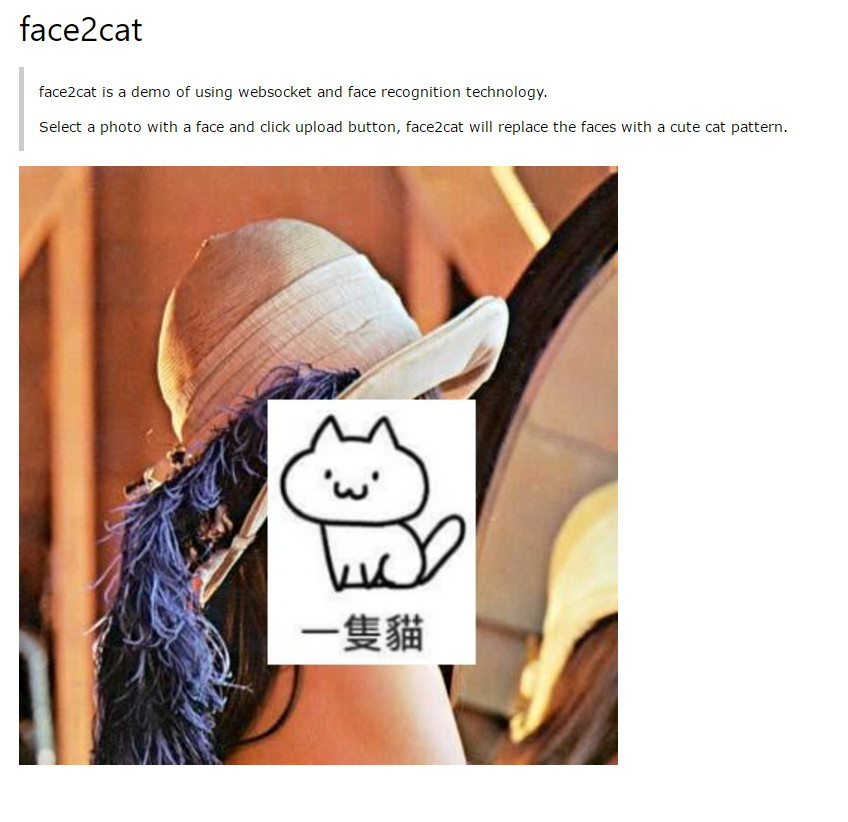

# face2cat
face2cat is a web application, replace the faces in the uploaded photo with a cute cat pattern.

There is already exist some applications like Black Bar Camera that can transfer a phote

into this

Don't you think this is boring? How about change the black bar into ... a cat !

moew~

## application screenshots

# Setup

You need to install OpenCV and ImageGisk before install.

    git clone https://github.com/johnson18404/face2cat 
    cd face2cat && npm install 
    
# Execute
    npm start

then you can open brower to http://localhost:3000

you can also change the port:

Linux:

    PORT=80 npm start

Windows:

    set PORT=80 && npm start

# LICENSE
MIT